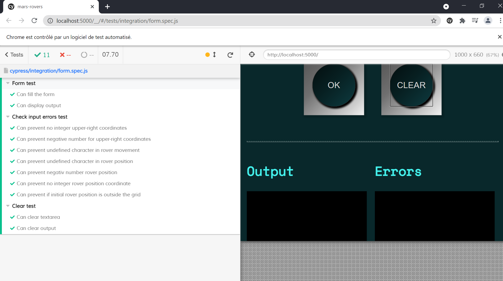
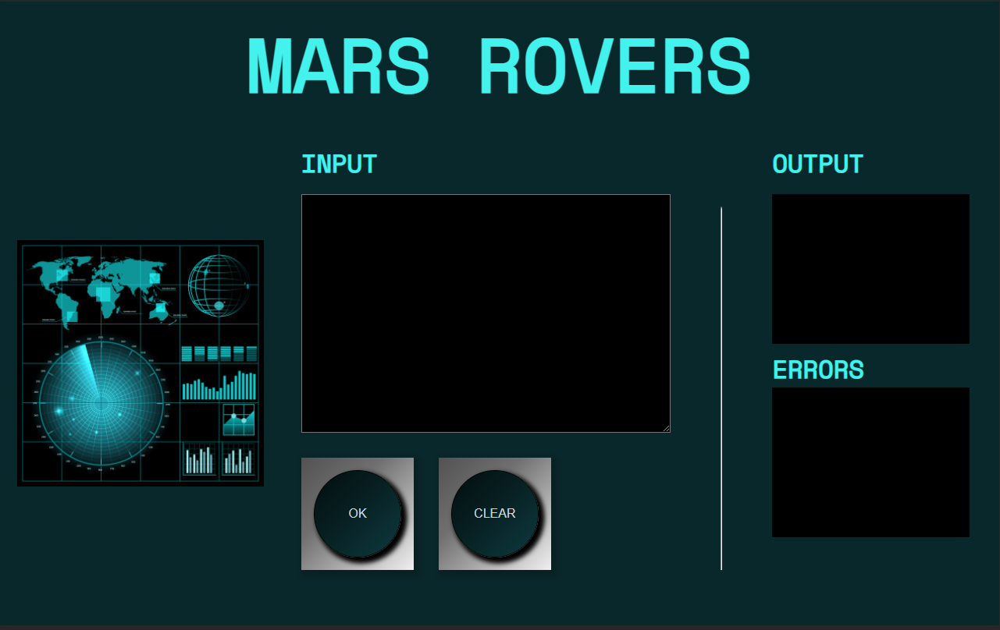
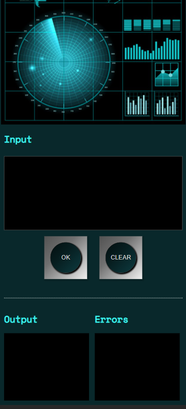

# mars-rovers

## Run application
* Clone the project
* `npm install`
* `npx serve` (Open the browser to the url http://localhost:5000)
* **Or you can directly access the website [here](https://geraldine1989.github.io/mars-rovers/)**

## Run tests
* Clone the project
* `npm install`
* `npx serve` (Open the browser to the url http://localhost:5000)
* open another terminal and run : `npm run e2e` to see cypress tests

## Explanation of the design

- First I get user's data and I create an array: inputData.
- I put aside in variables the data concerning the coordinates of the grid and I exclude them from the array.
- I split inputData array in two arrays : once concerns the rovers position and the other concerns their movements.
- Next I compare same indexes of these arrays.
- If indexes are the same : I loop on the letters concerning the movement of the rover.
- Each letter (L, R and M) corresponds to a specific function (function to turn left, to turn right and to moving forward). The result of these functions depends to the current orientation (N, S, E or W) of the rover. Then they return a new position (or the same position but the rover moves). If this letter corresponds to a rover movement and the rover is at the end of the grid, the position and orientation of the rover remains the same.
- When all letters of a rover have been consumed, result is pushed in a result array and we move the rover to the following index.
- User errors are pushed in an errors array.
- If errors array is not empty, I print the user errors, otherwise I print the result.

## Features

- This project contains:
	- The script in Javascript.
	- Tests with Cypress

  

	- Responsive design in css

	

	
- The user can:
	- Get the end position of the rovers
	- Be prevented if he entered the data incorrectly
	- Clear the data and enter others data.
